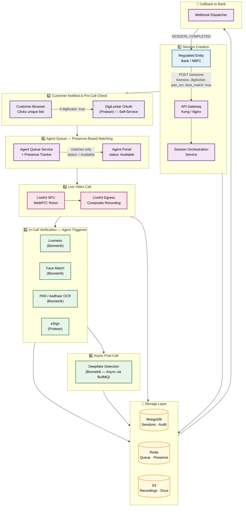
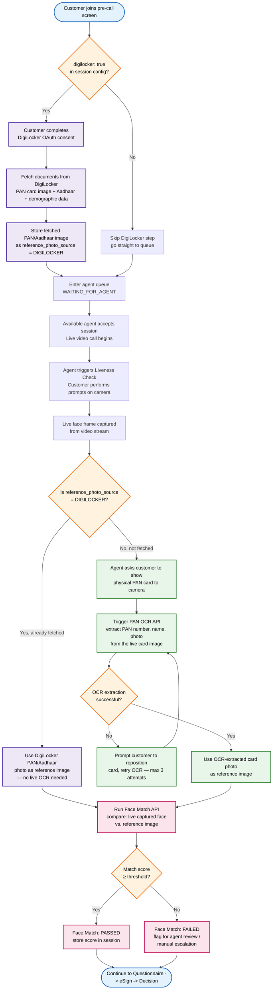
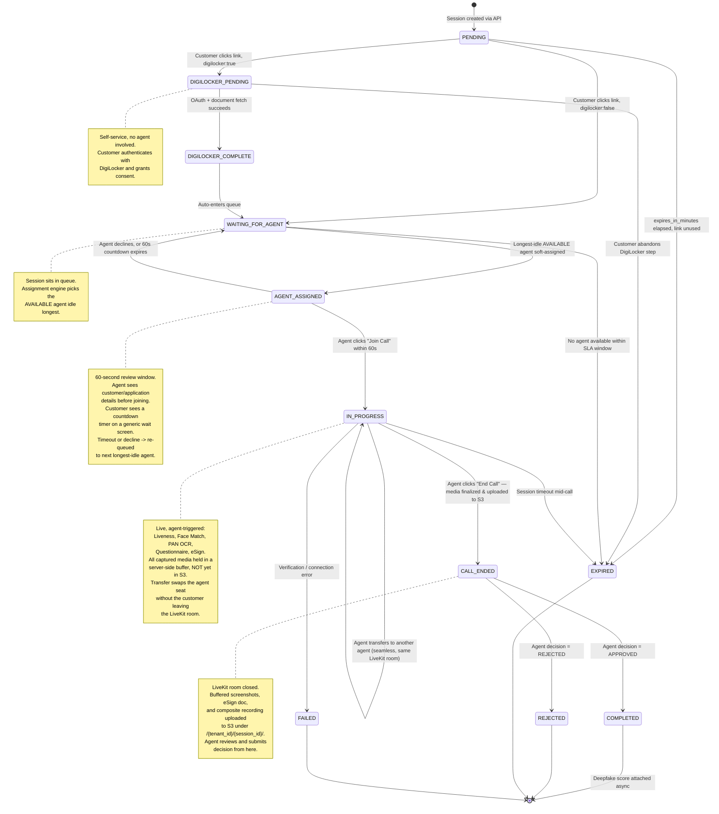
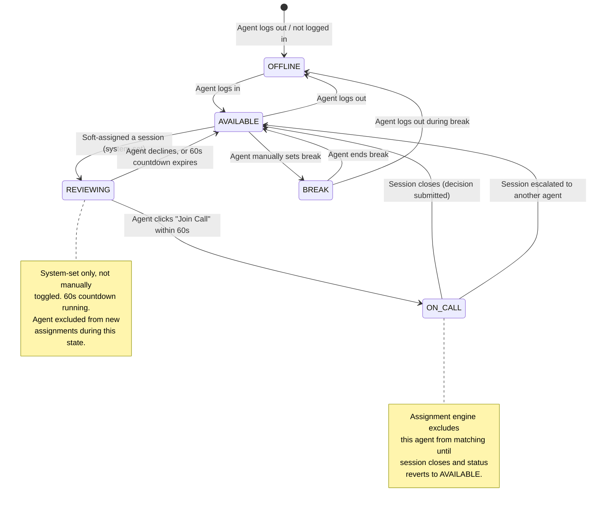
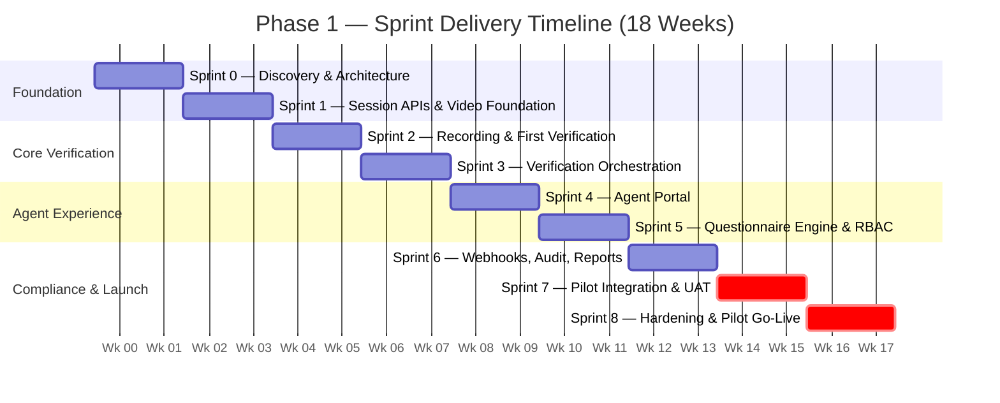
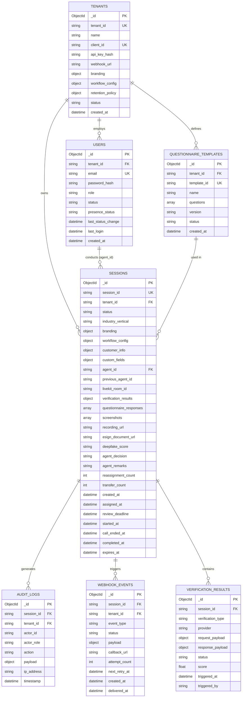

# Protean VBI Platform — Phase 1 (Core VKYC Pilot)
## Enhanced Architecture, Flow Diagrams & Complete Database Design

> **Scope**: Phase 1 only — Sprint 0 through Sprint 8 (18 Weeks / ~4.5 Months)
> **Goal**: One Protean customer running production Video KYC end-to-end, one industry vertical, all five Biometrik verification APIs orchestrated within the session.
> **Version**: 3.4 (Enhanced) | **Prepared by**: Biometrik Engineering Team

---

## Table of Contents
1. [System Architecture Diagram](#1-system-architecture-diagram)
2. [End-to-End VKYC Session Flow](#2-end-to-end-vkyc-session-flow)
3. [Session State Machine](#3-session-state-machine)
4. [Sprint Delivery Timeline](#4-sprint-delivery-timeline)
5. [Database Design — Complete Schema](#5-database-design--complete-schema)
6. [Indexing Strategy](#6-indexing-strategy)
7. [S3 Object Storage Structure](#7-s3-object-storage-structure)
8. [API Surface Summary — Request/Response Specs](#8-api-surface-summary)

---

## 1. System Architecture Diagram



**Design notes:** Each subgraph represents one stage of the flow in strict chronological order, so Mermaid lays them out top-to-bottom with no backward-pointing edges fighting the layout engine. Storage is a single shared layer near the bottom that every stage above writes into, instead of scattered cross-cutting arrows. Use `direction LR` inside each stage to keep sibling nodes readable side-by-side while the outer flow stays top-to-bottom.

---

### 1.1 Detailed Conditional Verification Flow — DigiLocker vs. Live PAN OCR

This is the logic that decides **which photo Face Match actually compares against** — the single most important branch in the whole session, and it wasn't explicit in the basic diagram above.



**How to read the two branches:**

| | **DigiLocker Path** | **Live PAN OCR Path** |
|---|---|---|
| **Trigger condition** | `digilocker: true` was set at session creation, and the customer completed OAuth consent pre-call | `digilocker: false`, or DigiLocker wasn't fetched for any reason |
| **When it runs** | Pre-call, self-service, no agent involved | In-call, agent explicitly asks customer to show the card |
| **Reference photo source** | The photo embedded in the DigiLocker-issued PAN/Aadhaar document | The photo extracted live by the PAN OCR API from the card held up to camera |
| **Face Match input** | Live captured face **vs.** DigiLocker document photo | Live captured face **vs.** OCR-extracted card photo |

**Why this branching matters architecturally:** Face Match is a single API call either way — `compare(live_face, reference_photo)` — but **where `reference_photo` comes from is conditional**, and that condition needs to be stored on the session (e.g. a `reference_photo_source` field: `DIGILOCKER` or `LIVE_OCR`) so the audit trail can show exactly which document the match was actually run against. This matters for RBI compliance review later — an auditor may ask "which document was this match based on," and the session record needs to answer that unambiguously.

**One open question worth confirming with your team lead:** if `digilocker: true` is set but the customer's OAuth fetch *fails or times out*, does the flow silently fall back to live PAN OCR, or does the session get flagged/rejected? Right now the diagram assumes graceful fallback isn't automatic — that's a design decision, not an assumption, so it's worth writing down explicitly in your Sprint 0 doc.

---

---

## 2. End-to-End VKYC Session Flow

```mermaid
sequenceDiagram
    autonumber
    participant RE as Regulated Entity
    participant GW as API Gateway
    participant SS as Session Service
    participant CUST as Customer UI
    participant DL as DigiLocker (Protean)
    participant QSVC as Agent Queue Service
    participant AGENT as Agent Portal
    participant LK as LiveKit SFU
    participant VER as Verification APIs
    participant ESIGN as eSign (Protean)
    participant DEEP as Deepfake (Async)
    participant WH as Webhook Dispatcher
    participant BUF as Session Buffer<br/>(server-side, temp)
    participant DB as MongoDB
    participant S3 as Object Storage

    rect rgb(227, 242, 253)
    Note over RE,DB: 1. Session Creation
    RE->>GW: POST /api/v1/sessions<br/>{ liveness, digilocker, pan_ocr, face_match: true }
    GW->>SS: Forward authenticated request
    SS->>DB: Create session doc — status PENDING
    SS-->>RE: 200 { session_id, customer_link }
    RE->>CUST: Notify customer (SMS / App push — RE-owned channel)
    end

    rect rgb(237, 231, 246)
    Note over CUST,SS: 2. Customer Joins — Pre-Call, No Agent Yet
    CUST->>SS: Click link, then complete device / camera / mic check
    alt digilocker: true
        CUST->>DL: OAuth consent + login
        DL-->>SS: Fetch PAN / Aadhaar documents
        SS->>DB: Store DigiLocker documents, status becomes DIGILOCKER_COMPLETE
    else digilocker: false
        SS->>DB: Skip straight to queue
    end
    end

    rect rgb(255, 243, 224)
    Note over CUST,AGENT: 3. Longest-Idle-Agent Assignment + 60s Review Window
    CUST->>QSVC: Enter queue, status becomes WAITING_FOR_AGENT
    QSVC->>DB: Find AVAILABLE agent with earliest last_status_change (longest idle)
    QSVC->>AGENT: Soft-assign session — push customer/application details
    QSVC->>DB: Session status becomes AGENT_ASSIGNED, assigned_at set, review_deadline = now + 60s
    QSVC->>DB: Agent status becomes REVIEWING
    QSVC->>CUST: Show waiting screen with countdown timer (customer sees generic wait, not internal state)

    alt Agent clicks "Join Call" within 60s
        AGENT->>QSVC: Accept
        QSVC->>DB: Session status becomes IN_PROGRESS, Agent status becomes ON_CALL
        WH->>RE: Webhook: SESSION_STARTED
    else Agent clicks "Decline" within 60s
        AGENT->>QSVC: Decline
        QSVC->>DB: Session status returns to WAITING_FOR_AGENT, Agent status becomes AVAILABLE
        QSVC->>QSVC: Re-run longest-idle match (excludes this agent for cooldown period)
    else 60s timeout, no response
        QSVC->>DB: Session status returns to WAITING_FOR_AGENT, Agent status becomes AVAILABLE
        QSVC->>QSVC: Re-run longest-idle match, reassign to next agent
    end
    end

    rect rgb(232, 245, 233)
    Note over CUST,LK: 4. Live Video Call Begins
    CUST->>LK: Join via WebRTC
    AGENT->>LK: Join via WebRTC
    LK->>S3: Begin composite recording (Egress)
    end

    rect rgb(252, 228, 236)
    Note over AGENT,BUF: 5. In-Call Verification — Direct Capture, No S3 Yet
    AGENT->>SS: Trigger Liveness (raw video frame data, not S3 ref)
    SS->>VER: POST liveness with captured data
    VER-->>SS: Liveness score
    SS->>BUF: Buffer liveness clip server-side

    alt DigiLocker photo already fetched
        AGENT->>SS: Trigger Face Match (reference_photo_source: DIGILOCKER)
    else No DigiLocker data
        AGENT->>SS: Trigger PAN OCR (raw card image data, not S3 ref)
        SS->>VER: POST pan-ocr with captured data
        VER-->>SS: Extracted PAN details + card photo
        SS->>BUF: Buffer extracted card photo
        AGENT->>SS: Trigger Face Match (reference_photo_source: LIVE_OCR)
    end
    SS->>VER: POST face-match (live frame data + buffered reference)
    VER-->>SS: Match score
    SS->>DB: Store verification results (scores only — images stay in buffer)
    end

    rect rgb(220, 237, 245)
    Note over AGENT,LK: 5.1 Optional — Transfer to Another Agent (Same Call, Seamless)
    AGENT->>QSVC: Request transfer (target agent or auto-pick longest-idle)
    QSVC->>DB: Find next AVAILABLE agent
    QSVC->>AGENT: New agent gets 60s accept/decline offer (same as initial assignment)
    Note over LK: Customer stays in the same LiveKit room throughout
    QSVC->>DB: Update agent_id once new agent accepts; original agent is released and becomes AVAILABLE
    end

    rect rgb(243, 229, 245)
    Note over AGENT,WH: 6. Questionnaire Phase
    AGENT->>SS: Submit questionnaire answers
    SS->>DB: Persist questionnaire responses
    WH->>RE: Webhook: QUESTIONNAIRE_COMPLETED
    end

    rect rgb(224, 242, 241)
    Note over AGENT,WH: 7. eSign Phase
    AGENT->>SS: Trigger eSign
    SS->>ESIGN: POST esign/initiate
    ESIGN-->>SS: Signed document artifact
    SS->>BUF: Buffer signed document (not S3 yet)
    WH->>RE: Webhook: ESIGN_COMPLETED
    end

    rect rgb(255, 249, 196)
    Note over AGENT,S3: 8. End Call — Finalize & Upload to S3
    AGENT->>SS: Click "End Call"
    SS->>LK: Close room
    LK->>BUF: Finalize composite recording into buffer
    SS->>S3: Upload buffered screenshots, eSign doc, recording<br/>to /{tenant_id}/{session_id}/
    S3-->>SS: Final s3:// URLs
    SS->>DB: Update status to CALL_ENDED, store final S3 URLs
    SS->>QSVC: Release agent, status returns to AVAILABLE
    end

    rect rgb(255, 224, 224)
    Note over AGENT,RE: 9. Decision & Session Closing
    AGENT->>SS: Submit decision (Approve / Reject / Escalate)
    SS->>DB: Update status to COMPLETED or REJECTED
    SS-->>DEEP: Enqueue deepfake job (async, non-blocking, runs against final S3 recording)
    DEEP-->>DB: Store deepfake score post-processing
    WH->>RE: Webhook: SESSION_COMPLETED
    RE->>GW: GET /api/v1/sessions/:session_id
    SS-->>RE: Full session result
    end
```

---

## 3. Session State Machine



### 3.1 Agent Presence State Machine

This runs independently of the session state machine above — it tracks each agent's own status, and the assignment engine only considers agents currently in `AVAILABLE`, sorted by `last_status_change` ascending (longest idle first).



---

## 4. Sprint Delivery Timeline



---

## 5. Database Design — Complete Schema

### 5.1 Entity Relationship Diagram



---

### 5.2 Full Collection Schemas

#### 5.2.1 `sessions`

> **Note on `branding`:** Not supplied by the RE at session creation (see Section 8.1) — the system copies it from the tenant's own `branding` config at the moment of creation and freezes it on the session document. This means historical sessions still reflect exactly what the customer saw at the time, even if the tenant later updates their logo or color scheme.

```json
{
  "_id": "ObjectId",
  "session_id": "vbi_2025_abc123",
  "tenant_id": "tenant_protean_pilot",
  "status": "PENDING | DIGILOCKER_PENDING | DIGILOCKER_COMPLETE | WAITING_FOR_AGENT | AGENT_ASSIGNED | IN_PROGRESS | CALL_ENDED | COMPLETED | REJECTED | EXPIRED | FAILED",
  "industry_vertical": "banking",
  "branding": {
    "logo_url": "https://cdn.bank.com/logo.png",
    "primary_color": "#003399",
    "secondary_color": "#FFFFFF",
    "dimensions": { "width": 400, "height": 600 }
  },
  "workflow_config": {
    "kyc_ocr": true,
    "opv": true,
    "face_match": true,
    "liveness": true,
    "deepfake": true,
    "esign": true,
    "questionnaire_template_id": "qt_banking_v1"
  },
  "customer_info": {
    "name": "John Doe",
    "phone": "+91XXXXXXXXXX",
    "application_id": "LOAN_APP_001"
  },
  "custom_fields": {
    "loan_amount": "500000",
    "branch_code": "MUM_001"
  },
  "agent_id": "ObjectId | null",
  "previous_agent_id": "ObjectId | null — set if this session was ever transferred",
  "reassignment_count": 0,
  "transfer_count": 0,
  "livekit_room_id": "room_vbi_abc123",
  "verification_results": {
    "kyc_ocr": { "status": "SUCCESS", "pan_number": "XXXXX0000X" },
    "opv": { "status": "SUCCESS", "verified": true },
    "face_match": { "status": "SUCCESS", "match_score": 0.96, "liveness_score": 0.99, "reference_photo_source": "DIGILOCKER" },
    "liveness": { "status": "SUCCESS", "is_live": true },
    "deepfake": { "status": "PENDING", "score": null }
  },
  "questionnaire_responses": [
    { "question_id": "q1", "question": "Are you the account holder?", "answer": "Yes" }
  ],
  "screenshots": ["s3://bucket/tenants/tenant_protean_pilot/sessions/vbi_2025_abc123/screenshot_001.jpg"],
  "recording_url": "s3://bucket/tenants/tenant_protean_pilot/sessions/vbi_2025_abc123/recording.mp4",
  "esign_document_url": "s3://bucket/tenants/tenant_protean_pilot/sessions/vbi_2025_abc123/signed_document.pdf",
  "agent_decision": "APPROVED | REJECTED | ESCALATED | null",
  "agent_remarks": "All checks passed.",
  "created_at": "ISODate",
  "assigned_at": "ISODate — set when agent is soft-assigned, cleared on decline/timeout",
  "review_deadline": "ISODate — assigned_at + 60 seconds, checked by a sweep job",
  "started_at": "ISODate — set only when agent actually joins the call",
  "call_ended_at": "ISODate — set when End Call finalizes media to S3, before decision is submitted",
  "completed_at": "ISODate",
  "expires_at": "ISODate"
}
```

**New fields explained:**
- `assigned_at` / `review_deadline` — power the 60-second countdown. A scheduled sweep job (or a delayed BullMQ job set at assignment time) checks `review_deadline` and auto-reverts the session to `WAITING_FOR_AGENT` if the agent hasn't responded.
- `reassignment_count` — increments every time a session gets declined/timed-out and re-queued at the initial assignment stage. Useful for monitoring — if a session gets reassigned 3+ times, that's worth surfacing to a supervisor rather than silently retrying forever.
- `transfer_count` / `previous_agent_id` — distinct from `reassignment_count`: this tracks mid-call transfers (an agent already live with the customer handing off to another agent), not pre-call reassignment. Keeping these as separate counters matters for reporting — a session that got reassigned twice before anyone answered is a queue-health problem; a session that got transferred twice mid-call is a different kind of signal (possibly a complex case needing escalation).
- `screenshots` / `recording_url` / `esign_document_url` — **only populated with final `s3://` URLs once the session reaches `CALL_ENDED`.** Before that, these fields are empty/null on the document — the actual bytes live in the temporary server-side session buffer (not modeled as a MongoDB collection, since it's short-lived and cleared on successful upload), not referenced from Mongo at all until finalization succeeds.
- `verification_results.face_match.reference_photo_source` — records which comparison source (`DIGILOCKER` or `LIVE_OCR`) was actually used, for audit purposes. **Open question carried over from the API doc:** if a workflow ever needs *both* a DigiLocker comparison *and* a Live-OCR comparison for the same session (not just whichever is available), this field would need to become an array of result objects instead of a single object — flag this to confirm before Sprint 2 build starts, since it changes the schema shape.

#### 5.2.2 `tenants`

```json
{
  "_id": "ObjectId",
  "tenant_id": "tenant_protean_pilot",
  "name": "Pilot Bank Ltd.",
  "client_id": "client_9f8a2c",
  "api_key_hash": "sha256:...",
  "webhook_url": "https://pilotbank.example.com/webhooks/vbi",
  "branding": {
    "logo_url": "https://cdn.bank.com/logo.png",
    "primary_color": "#003399",
    "secondary_color": "#FFFFFF"
  },
  "workflow_config": {
    "default_expiry_minutes": 60,
    "enabled_verifications": ["kyc_ocr", "opv", "face_match", "liveness", "deepfake", "esign"]
  },
  "retention_policy": {
    "recording_retention_days": 365,
    "screenshot_retention_days": 365,
    "audit_retention_days": 2555
  },
  "status": "ACTIVE | SUSPENDED | ONBOARDING",
  "created_at": "ISODate"
}
```

#### 5.2.3 `users`

```json
{
  "_id": "ObjectId",
  "tenant_id": "tenant_protean_pilot",
  "email": "agent01@pilotbank.example.com",
  "password_hash": "bcrypt:...",
  "role": "RE_ADMIN | RE_MANAGER | RE_AGENT",
  "status": "ACTIVE | INACTIVE | INVITED",
  "presence_status": "AVAILABLE | REVIEWING | ON_CALL | BREAK | OFFLINE",
  "last_status_change": "ISODate — used to sort AVAILABLE agents by longest-idle for assignment",
  "last_login": "ISODate",
  "created_at": "ISODate"
}
```

**Note:** `presence_status` and `last_status_change` are the two fields the assignment engine actually queries — every time an agent's status flips (e.g. `REVIEWING → AVAILABLE` after declining, or `ON_CALL → AVAILABLE` after a session closes), `last_status_change` resets to now. The **longest-idle-first** query is simply: `find({ presence_status: "AVAILABLE" }).sort({ last_status_change: 1 }).limit(1)`.

#### 5.2.4 `questionnaire_templates`

```json
{
  "_id": "ObjectId",
  "tenant_id": "tenant_protean_pilot",
  "template_id": "qt_banking_v1",
  "name": "Banking Vertical — Standard VKYC Questionnaire",
  "questions": [
    {
      "question_id": "q1",
      "question": "Are you the primary account holder?",
      "type": "YES_NO",
      "mandatory": true,
      "sequence": 1
    },
    {
      "question_id": "q2",
      "question": "What is your loan purpose?",
      "type": "MCQ",
      "options": ["Home Purchase", "Business", "Education", "Other"],
      "mandatory": true,
      "sequence": 2
    },
    {
      "question_id": "q3",
      "question": "Confirm your registered mobile number",
      "type": "TEXT",
      "mandatory": true,
      "sequence": 3
    }
  ],
  "version": "1.0",
  "status": "ACTIVE | DRAFT | ARCHIVED",
  "created_at": "ISODate"
}
```

#### 5.2.5 `audit_logs`

```json
{
  "_id": "ObjectId",
  "session_id": "vbi_2025_abc123",
  "tenant_id": "tenant_protean_pilot",
  "actor_id": "agent_007 | system | customer_xyz",
  "actor_role": "RE_AGENT | SYSTEM | CUSTOMER",
  "action": "SESSION_CREATED | AGENT_JOINED | VERIFICATION_TRIGGERED | DECISION_SUBMITTED | ...",
  "payload": { "field": "value — context specific to the action" },
  "ip_address": "203.0.113.42",
  "timestamp": "ISODate"
}
```

#### 5.2.6 `webhook_events`

```json
{
  "_id": "ObjectId",
  "session_id": "vbi_2025_abc123",
  "tenant_id": "tenant_protean_pilot",
  "event_type": "SESSION_STARTED | QUESTIONNAIRE_COMPLETED | ESIGN_COMPLETED | SESSION_COMPLETED | SESSION_FAILED | SESSION_PENDING",
  "status": "PENDING | DELIVERED | FAILED | DEAD_LETTER",
  "payload": {
    "event": "SESSION_COMPLETED",
    "session_id": "vbi_2025_abc123",
    "data": { "status": "COMPLETED", "agent_decision": "APPROVED" }
  },
  "callback_url": "https://pilotbank.example.com/webhooks/vbi",
  "attempt_count": 1,
  "next_retry_at": "ISODate | null",
  "created_at": "ISODate",
  "delivered_at": "ISODate | null"
}
```

#### 5.2.7 `verification_results`

```json
{
  "_id": "ObjectId",
  "session_id": "vbi_2025_abc123",
  "verification_type": "FACE_MATCH | LIVENESS | DEEPFAKE | KYC_OCR | OPV | ESIGN",
  "provider": "BIOMETRIK | PROTEAN",
  "request_payload": { "session_id": "vbi_2025_abc123", "image_buffer_ref": "buf_9f8a2c1b — internal server-side buffer key, not an S3 path" },
  "response_payload": { "match_score": 0.96, "liveness_score": 0.99 },
  "status": "SUCCESS | FAILED | PENDING | TIMEOUT",
  "score": 0.96,
  "triggered_at": "ISODate",
  "triggered_by": "agent_007"
}
```
*(`request_payload.image_buffer_ref` replaces what would have been an `s3://` path in v1.0 — the raw image never touches S3 at verification time; it's held in the session-scoped server-side buffer and only gets a real `s3://` URL once `end-call` runs, per Section 8.1's updated verification API contracts.)*

---

## 6. Indexing Strategy

| Collection | Index | Purpose |
|---|---|---|
| `sessions` | `{ session_id: 1 }` unique | Fast lookup by public session ID |
| `sessions` | `{ tenant_id: 1, status: 1, created_at: -1 }` | Tenant dashboards, queue filtering |
| `sessions` | `{ agent_id: 1, status: 1 }` | Agent queue retrieval |
| `sessions` | `{ expires_at: 1 }` TTL-adjacent | Expiry sweep job |
| `sessions` | `{ status: 1, review_deadline: 1 }` | 60s review-timeout sweep — finds `AGENT_ASSIGNED` sessions past deadline |
| `tenants` | `{ tenant_id: 1 }` unique, `{ client_id: 1 }` unique | Auth + provisioning lookups |
| `users` | `{ email: 1 }` unique, `{ tenant_id: 1, role: 1 }` | Login, RBAC queries |
| `users` | `{ tenant_id: 1, presence_status: 1, last_status_change: 1 }` | Longest-idle-agent assignment query |
| `audit_logs` | `{ session_id: 1, timestamp: -1 }` | Session audit trail retrieval |
| `audit_logs` | `{ tenant_id: 1, timestamp: -1 }` | Compliance exports |
| `webhook_events` | `{ status: 1, next_retry_at: 1 }` | Retry worker polling |
| `verification_results` | `{ session_id: 1, verification_type: 1 }` unique compound | Prevent duplicate verification writes |

---

## 7. S3 Object Storage Structure

```
s3://protean-vbi-bucket/
└── tenants/
    └── {tenant_id}/
        └── sessions/
            └── {session_id}/
                ├── recording.mp4
                ├── screenshot_001.jpg
                ├── screenshot_002.jpg
                ├── signed_document.pdf
                ├── compliance_report.pdf
                └── audit_export.json
```

**Write timing — this matters more than the folder structure itself:** Nothing above gets written to S3 during the live call. All in-call captured assets (liveness clips, PAN card images, live face frames, screenshots, the eSign document) are held in a **temporary server-side session buffer** for the duration of the call — not the client's browser storage, since a crashed agent tab shouldn't mean lost evidence. The **`End Call`** action (API doc Section 11.1) is what triggers the bulk upload of everything above to this exact folder structure in one step, and updates the session document's `screenshots`/`recording_url`/`esign_document_url` fields with the resulting `s3://` paths only at that point.

**Failure handling:** if the End Call upload step fails partway (e.g. S3 outage), the buffer must **not** be cleared — retry via a queued job (BullMQ, exponential backoff) rather than losing the session's evidence. This is worth treating as a first-class failure mode in Sprint 2, not an edge case bolted on later, since losing a completed KYC recording because of a transient S3 blip would force the customer to redo the entire call.

---

## 8. API Surface Summary

> **This section now provides the high-level map only.** Full request/response specs, curl samples, and every error case live in the dedicated **`API_Documentation.md`** file, which is the source of truth going forward — it now also includes Update/Delete Session, Transfer Call, End Call & Finalize Media, and the updated direct-capture verification contracts (base64 payloads instead of S3 references, since assets are buffered server-side and only written to S3 when the agent ends the call — see Section 7 above for the storage lifecycle).

### 8.0 Standard Response Envelope

Every endpoint in the platform returns responses in one consistent envelope, so the frontend/agent portal/RE integrations only need to write **one** response-handling path.

**Success envelope:**
```json
{
  "success": true,
  "data": { },
  "meta": {
    "request_id": "req_9f8a2c1b",
    "timestamp": "2026-07-07T10:15:30.000Z"
  }
}
```

**Error envelope (used for ALL failure types — validation, business logic, downstream/service failures):**
```json
{
  "success": false,
  "error": {
    "code": "VALIDATION_ERROR",
    "message": "Human-readable summary of what went wrong",
    "details": [
      { "field": "workflow_config.face_match", "issue": "must be a boolean" }
    ]
  },
  "meta": {
    "request_id": "req_9f8a2c1b",
    "timestamp": "2026-07-07T10:15:30.000Z"
  }
}
```

**Standard HTTP status + error code mapping (applies across every endpoint below):**

| HTTP Status | `error.code` | Meaning |
|---|---|---|
| 400 | `VALIDATION_ERROR` | Request body failed schema validation (missing/wrong-type field) |
| 401 | `UNAUTHORIZED` | Missing/invalid API key or JWT |
| 403 | `FORBIDDEN` | Valid auth, but role/tenant not permitted for this action |
| 404 | `NOT_FOUND` | session_id / resource doesn't exist |
| 409 | `CONFLICT` | Action invalid for current state (e.g. submitting a decision on an already-COMPLETED session) |
| 422 | `BUSINESS_RULE_VIOLATION` | Passes schema validation but fails a business rule (e.g. OCR retry limit exceeded) |
| 429 | `RATE_LIMITED` | Too many requests — Kong/Nginx rate limit hit |
| 502 | `DOWNSTREAM_SERVICE_ERROR` | A dependency (Biometrik verification API, Protean eSign/DigiLocker/OPV, LiveKit) returned an error or timed out |
| 503 | `SERVICE_UNAVAILABLE` | Our own service (DB, Redis, or the service itself) is down/unreachable |
| 504 | `GATEWAY_TIMEOUT` | Downstream call exceeded configured timeout (e.g. Deepfake API took too long) |

---

### 8.1 Session Management APIs

#### `POST /api/v1/sessions` — Create Session

**Request body:**
```json
{
  "tenant_id": "tenant_protean_pilot",
  "customer_info": {
    "name": "Rahul Sharma",
    "phone": "+919876543210",
    "application_id": "LOAN_APP_001"
  },
  "workflow_config": {
    "liveness": true,
    "digilocker": true,
    "pan_ocr": true,
    "face_match": true,
    "esign": true,
    "questionnaire_template_id": "qt_banking_v1"
  },
  "custom_fields": {
    "loan_amount": "500000",
    "branch_code": "MUM_001"
  },
  "expires_in_minutes": 60
}
```

**Note:** `branding` is no longer part of the session creation payload — it's inherited from the tenant's own `branding` config (see the `tenants` collection in Section 5) at read-time, since it rarely changes per-session and shouldn't have to be repeated on every API call. If a specific RE ever needs per-session branding overrides, that would be a deliberate future addition, not the Phase 1 default.

**Success — 201 Created:**
```json
{
  "success": true,
  "data": {
    "session_id": "vbi_2025_abc123",
    "status": "PENDING",
    "customer_link": "https://vkyc.pilotbank.com/join/vbi_2025_abc123",
    "expires_at": "2026-07-07T11:15:30.000Z"
  },
  "meta": { "request_id": "req_9f8a2c1b", "timestamp": "2026-07-07T10:15:30.000Z" }
}
```

**Validation error — 400 Bad Request** (e.g. `face_match` sent as a string instead of boolean, or `tenant_id` missing):
```json
{
  "success": false,
  "error": {
    "code": "VALIDATION_ERROR",
    "message": "Request body failed validation",
    "details": [
      { "field": "workflow_config.face_match", "issue": "must be a boolean" },
      { "field": "tenant_id", "issue": "required field missing" }
    ]
  },
  "meta": { "request_id": "req_9f8a2c1b", "timestamp": "2026-07-07T10:15:30.000Z" }
}
```

**Service down — 503 Service Unavailable** (e.g. MongoDB unreachable when trying to create the session doc):
```json
{
  "success": false,
  "error": {
    "code": "SERVICE_UNAVAILABLE",
    "message": "Unable to create session — database temporarily unavailable. Please retry.",
    "details": []
  },
  "meta": { "request_id": "req_9f8a2c1b", "timestamp": "2026-07-07T10:15:30.000Z" }
}
```

---

#### `GET /api/v1/sessions/:session_id` — Get Session Status

**Request body:** none (path param only)

**Success — 200 OK:**
```json
{
  "success": true,
  "data": {
    "session_id": "vbi_2025_abc123",
    "status": "COMPLETED",
    "agent_decision": "APPROVED",
    "verification_results": {
      "liveness": { "status": "SUCCESS", "is_live": true },
      "face_match": { "status": "SUCCESS", "match_score": 0.96, "reference_photo_source": "DIGILOCKER" },
      "pan_ocr": { "status": "SKIPPED", "reason": "DigiLocker photo used instead" },
      "deepfake": { "status": "PENDING", "score": null }
    },
    "recording_url": "s3://bucket/tenants/tenant_protean_pilot/sessions/vbi_2025_abc123/recording.mp4",
    "completed_at": "2026-07-07T10:45:00.000Z"
  },
  "meta": { "request_id": "req_a1b2c3d4", "timestamp": "2026-07-07T10:46:00.000Z" }
}
```

**Not found — 404 Not Found:**
```json
{
  "success": false,
  "error": {
    "code": "NOT_FOUND",
    "message": "Session vbi_2025_xyz999 does not exist",
    "details": []
  },
  "meta": { "request_id": "req_a1b2c3d4", "timestamp": "2026-07-07T10:46:00.000Z" }
}
```

---

### 8.2 Agent Operations APIs

#### `PATCH /api/v1/agent/presence` — Update Agent Presence Status

**Request body:**
```json
{
  "status": "AVAILABLE"
}
```
*(allowed values: `AVAILABLE`, `ON_CALL`, `BREAK`, `OFFLINE` — `ON_CALL` is system-set only, not agent-settable)*

**Success — 200 OK:**
```json
{
  "success": true,
  "data": { "agent_id": "agent_007", "status": "AVAILABLE", "updated_at": "2026-07-07T10:00:00.000Z" },
  "meta": { "request_id": "req_p1p2p3", "timestamp": "2026-07-07T10:00:00.000Z" }
}
```

**Validation error — 400 Bad Request** (agent tries to manually set `ON_CALL`):
```json
{
  "success": false,
  "error": {
    "code": "VALIDATION_ERROR",
    "message": "status ON_CALL cannot be set manually — it is system-managed",
    "details": [ { "field": "status", "issue": "not an agent-settable value" } ]
  },
  "meta": { "request_id": "req_p1p2p3", "timestamp": "2026-07-07T10:00:00.000Z" }
}
```

---

#### System-Triggered: Soft-Assignment (No API Call — Internal Engine Action)

There is no customer/agent-facing endpoint for "assignment" itself — the assignment engine runs internally (a queue worker) and pushes the offer to the agent via WebSocket. The two endpoints below are what the **agent's UI** calls in response to that push.

#### `POST /api/v1/agent/sessions/:session_id/accept` — Agent Accepts Within 60s Review Window

**Request body:** none (path param only; agent identity comes from JWT)

**Success — 200 OK:**
```json
{
  "success": true,
  "data": { "session_id": "vbi_2025_abc123", "agent_id": "agent_007", "status": "IN_PROGRESS" },
  "meta": { "request_id": "req_q1q2q3", "timestamp": "2026-07-07T10:10:00.000Z" }
}
```

**Conflict — 409 Conflict** (review_deadline already passed, session was reassigned before the click registered):
```json
{
  "success": false,
  "error": {
    "code": "CONFLICT",
    "message": "Review window has expired — this session has been reassigned to another agent",
    "details": []
  },
  "meta": { "request_id": "req_q1q2q3", "timestamp": "2026-07-07T10:10:00.000Z" }
}
```

---

#### `POST /api/v1/agent/sessions/:session_id/decline` — Agent Declines Within Review Window

**Request body:**
```json
{
  "reason": "PERSONAL_CONFLICT"
}
```
*(optional field, allowed values e.g. `PERSONAL_CONFLICT`, `TECHNICAL_ISSUE`, `OTHER` — used for internal monitoring, not shown to customer)*

**Success — 200 OK:**
```json
{
  "success": true,
  "data": { "session_id": "vbi_2025_abc123", "status": "WAITING_FOR_AGENT", "reassignment_count": 1 },
  "meta": { "request_id": "req_dc1dc2", "timestamp": "2026-07-07T10:10:15.000Z" }
}
```

**Note on the 60s timeout path:** there's no client-called endpoint for timeout — a background sweep job (checking the `{ status: 1, review_deadline: 1 }` index every few seconds) automatically reverts any `AGENT_ASSIGNED` session past its `review_deadline` back to `WAITING_FOR_AGENT`, exactly like the decline path, just system-triggered instead of agent-triggered.

---

#### `POST /api/v1/agent/sessions/:session_id/decision` — Submit Agent Decision

**Request body:**
```json
{
  "decision": "APPROVED",
  "remarks": "All verification checks passed. Customer identity confirmed."
}
```
*(allowed `decision` values: `APPROVED`, `REJECTED`, `ESCALATED`)*

**Success — 200 OK:**
```json
{
  "success": true,
  "data": { "session_id": "vbi_2025_abc123", "status": "COMPLETED", "agent_decision": "APPROVED" },
  "meta": { "request_id": "req_d1d2d3", "timestamp": "2026-07-07T10:45:00.000Z" }
}
```

**Conflict — 409 Conflict** (session already closed, or required verifications not yet completed):
```json
{
  "success": false,
  "error": {
    "code": "CONFLICT",
    "message": "Cannot submit decision — required verification 'face_match' has not completed",
    "details": [ { "field": "verification_results.face_match.status", "issue": "must be SUCCESS or FAILED before decision" } ]
  },
  "meta": { "request_id": "req_d1d2d3", "timestamp": "2026-07-07T10:45:00.000Z" }
}
```

---

### 8.3 Verification Trigger APIs

#### `POST /api/v1/sessions/:session_id/verify/face-match`

**Request body:**
```json
{
  "live_face_frame": "s3://bucket/.../live_frame_capture.jpg",
  "reference_photo_source": "DIGILOCKER"
}
```
*(`reference_photo_source` is `DIGILOCKER` or `LIVE_OCR` — set based on the conditional flow from Section 1.1; if `LIVE_OCR`, the reference photo comes from the `pan-ocr` result already stored on the session)*

**Success — 200 OK:**
```json
{
  "success": true,
  "data": {
    "verification_type": "FACE_MATCH",
    "status": "SUCCESS",
    "match_score": 0.96,
    "threshold": 0.85,
    "passed": true
  },
  "meta": { "request_id": "req_f1f2f3", "timestamp": "2026-07-07T10:20:00.000Z" }
}
```

**Business rule violation — 422 Unprocessable Entity** (e.g. `reference_photo_source: LIVE_OCR` but PAN OCR hasn't been run yet on this session):
```json
{
  "success": false,
  "error": {
    "code": "BUSINESS_RULE_VIOLATION",
    "message": "reference_photo_source is LIVE_OCR but no PAN OCR result exists on this session yet",
    "details": []
  },
  "meta": { "request_id": "req_f1f2f3", "timestamp": "2026-07-07T10:20:00.000Z" }
}
```

**Downstream service error — 502 Bad Gateway** (Biometrik's Face Match API itself returned an error or malformed response):
```json
{
  "success": false,
  "error": {
    "code": "DOWNSTREAM_SERVICE_ERROR",
    "message": "Face Match provider returned an error — please retry the verification",
    "details": [ { "provider": "BIOMETRIK_FACE_MATCH", "upstream_status": 500 } ]
  },
  "meta": { "request_id": "req_f1f2f3", "timestamp": "2026-07-07T10:20:00.000Z" }
}
```

**Gateway timeout — 504 Gateway Timeout:**
```json
{
  "success": false,
  "error": {
    "code": "GATEWAY_TIMEOUT",
    "message": "Face Match provider did not respond within 15s — please retry",
    "details": []
  },
  "meta": { "request_id": "req_f1f2f3", "timestamp": "2026-07-07T10:20:00.000Z" }
}
```

---

#### `POST /api/v1/sessions/:session_id/verify/pan-ocr`

**Request body:**
```json
{
  "card_image": "s3://bucket/.../pan_card_capture.jpg"
}
```

**Success — 200 OK:**
```json
{
  "success": true,
  "data": {
    "verification_type": "PAN_OCR",
    "status": "SUCCESS",
    "pan_number": "ABCDE1234F",
    "name_on_card": "RAHUL SHARMA",
    "extracted_photo_url": "s3://bucket/.../pan_photo_extracted.jpg"
  },
  "meta": { "request_id": "req_o1o2o3", "timestamp": "2026-07-07T10:18:00.000Z" }
}
```

**Business rule violation — 422 Unprocessable Entity** (OCR retry limit exceeded — image quality too poor after 3 attempts):
```json
{
  "success": false,
  "error": {
    "code": "BUSINESS_RULE_VIOLATION",
    "message": "PAN OCR failed after 3 attempts — card image quality insufficient",
    "details": [ { "field": "card_image", "issue": "blurred or glare detected in all 3 attempts" } ]
  },
  "meta": { "request_id": "req_o1o2o3", "timestamp": "2026-07-07T10:18:00.000Z" }
}
```

---

#### `POST /api/v1/sessions/:session_id/verify/esign`

**Request body:**
```json
{
  "document_template_id": "loan_consent_v2",
  "signer_name": "Rahul Sharma",
  "signer_phone": "+919876543210"
}
```

**Success — 200 OK:**
```json
{
  "success": true,
  "data": {
    "verification_type": "ESIGN",
    "status": "SUCCESS",
    "signed_document_url": "s3://bucket/.../signed_document.pdf",
    "signed_at": "2026-07-07T10:40:00.000Z"
  },
  "meta": { "request_id": "req_e1e2e3", "timestamp": "2026-07-07T10:40:00.000Z" }
}
```

**Downstream service error — 502 Bad Gateway** (Protean's eSign service is down):
```json
{
  "success": false,
  "error": {
    "code": "DOWNSTREAM_SERVICE_ERROR",
    "message": "eSign provider unavailable — please retry shortly",
    "details": [ { "provider": "PROTEAN_ESIGN", "upstream_status": 503 } ]
  },
  "meta": { "request_id": "req_e1e2e3", "timestamp": "2026-07-07T10:40:00.000Z" }
}
```

---

### 8.4 Questionnaire APIs

#### `POST /api/v1/sessions/:session_id/questionnaire/submit`

**Request body:**
```json
{
  "responses": [
    { "question_id": "q1", "answer": "Yes" },
    { "question_id": "q2", "answer": "Home Purchase" },
    { "question_id": "q3", "answer": "9876543210" }
  ]
}
```

**Success — 200 OK:**
```json
{
  "success": true,
  "data": { "session_id": "vbi_2025_abc123", "questionnaire_status": "COMPLETED" },
  "meta": { "request_id": "req_qn1qn2", "timestamp": "2026-07-07T10:35:00.000Z" }
}
```

**Validation error — 400 Bad Request** (a mandatory question was left unanswered):
```json
{
  "success": false,
  "error": {
    "code": "VALIDATION_ERROR",
    "message": "Mandatory question q1 is missing a response",
    "details": [ { "field": "responses[0].answer", "issue": "required" } ]
  },
  "meta": { "request_id": "req_qn1qn2", "timestamp": "2026-07-07T10:35:00.000Z" }
}
```

---

### 8.5 Endpoint Reference Table

| Category | Endpoint | Method | Auth | Req Body? |
|---|---|---|---|---|
| Session Mgmt | `/api/v1/sessions` | POST | API Key | ✅ |
| Session Mgmt | `/api/v1/sessions/:session_id` | POST | API Key | ✅ `{tenant_id, data}` — update, restricted to PENDING/WAITING_FOR_AGENT |
| Session Mgmt | `/api/v1/sessions/:session_id` | DELETE | Internal admin only | ❌ |
| Session Mgmt | `/api/v1/sessions/:session_id` | GET | API Key | ❌ |
| Session Mgmt | `/api/v1/sessions/:session_id/report` | GET | API Key / JWT | ❌ |
| Session Mgmt | `/api/v1/sessions/:session_id/expire` | PATCH | API Key | ❌ |
| Agent Ops | `/api/v1/agent/presence` | PATCH | JWT | ✅ |
| Agent Ops | `/api/v1/agent/queue` | GET | JWT (Manager/Admin) | ❌ |
| Agent Ops | `/api/v1/agent/sessions/:session_id/accept` | POST | JWT | ❌ |
| Agent Ops | `/api/v1/agent/sessions/:session_id/decline` | POST | JWT | ✅ optional reason |
| Agent Ops | `/api/v1/agent/sessions/:session_id/transfer` | POST | JWT | ✅ target_agent_id (optional), reason |
| Agent Ops | `/api/v1/agent/sessions/:session_id/end-call` | POST | JWT | ❌ — closes room, uploads buffered media to S3 |
| Agent Ops | `/api/v1/agent/sessions/:session_id/decision` | POST | JWT | ✅ — only after `end-call` |
| Agent Ops | `/api/v1/agent/sessions/:session_id/screenshot` | POST | JWT | ✅ base64 image data (buffered) |
| Agent Ops | `/api/v1/agent/sessions/:session_id/workspace` | GET | JWT | ❌ |
| Verification | `/api/v1/sessions/:session_id/verify/liveness` | POST | JWT | ✅ base64 video/frame data (buffered) |
| Verification | `/api/v1/sessions/:session_id/verify/face-match` | POST | JWT | ✅ base64 live frame + `reference_photo_source` |
| Verification | `/api/v1/sessions/:session_id/verify/pan-ocr` | POST | JWT | ✅ base64 card image data (buffered) |
| Verification | `/api/v1/sessions/:session_id/verify/esign` | POST | JWT | ✅ |
| Verification | `/api/v1/sessions/:session_id/verify/results` | GET | JWT | ❌ |
| Questionnaire | `/api/v1/sessions/:session_id/questionnaire` | GET | JWT | ❌ |
| Questionnaire | `/api/v1/sessions/:session_id/questionnaire/submit` | POST | JWT | ✅ |
| Auth | `/api/v1/auth/login` | POST | Public | ✅ email/password |
| Auth | `/api/v1/auth/refresh` | POST | Refresh Token | ✅ refresh_token |
| Auth | `/api/v1/auth/logout` | POST | JWT | ❌ |

---

*Prepared by: Biometrik Engineering Team*
*Phase: 1 — Sprint 0 to Sprint 8 (18 Weeks)*
*Version: 3.5 — Added `CALL_ENDED` session status with server-side media buffering (screenshots/eSign/recording upload to S3 deferred to End Call), Transfer Call (seamless mid-call agent handoff), and removed `branding` from session creation payload (now tenant-inherited). Full API request/response specs moved to dedicated `API_Documentation.md`.*
